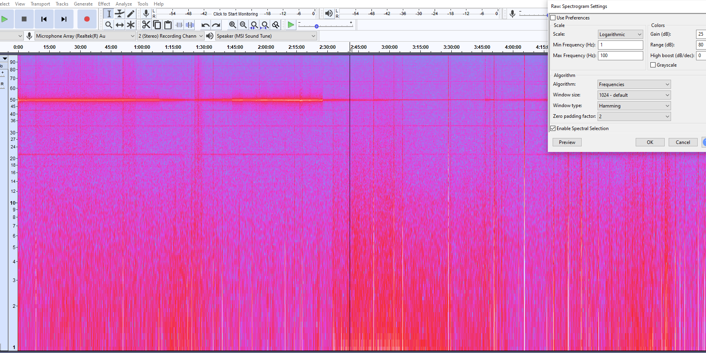

# Muse S Data Processing - should also work the same for the Muse 2 band
Convert data from Mind Monitor to a WAV for viewing in spectrogram tools

Still a WIP right now but working pretty well. The script should be placed in the same folder as the MindView CSV and that CSV should be renamed to 'sleepData.csv'.

When recording from the Mind Monitor app you need to ensure you set the sampling rate to constant, this will generate large csv files particularly for overnight sleep analysis but the zipped file is highly compressed.

The script processes data from AF7 into a WAV file that you can then use in either a dedicated spectrogram tool or something like Audacity https://manual.audacityteam.org/man/spectrogram_view.html

The script also exports relative brainwaves into a CSV that you can open in Excel - it downsamples the full file so it's more manageable. For charting etc I'd suggest adding a moving average so it's easier to see.

Once the script is finished it displays a PSD chart so you can sense check the data/processing.

Couple of caveats right now are that I need to work more on the bad data handling more, I think it's probably overly brutal. Also should make use of the other channels rather than just AF7.

Example spectrogram in Audacity - have random bar at around 50Hz, apparently not uncommon sometimes:

